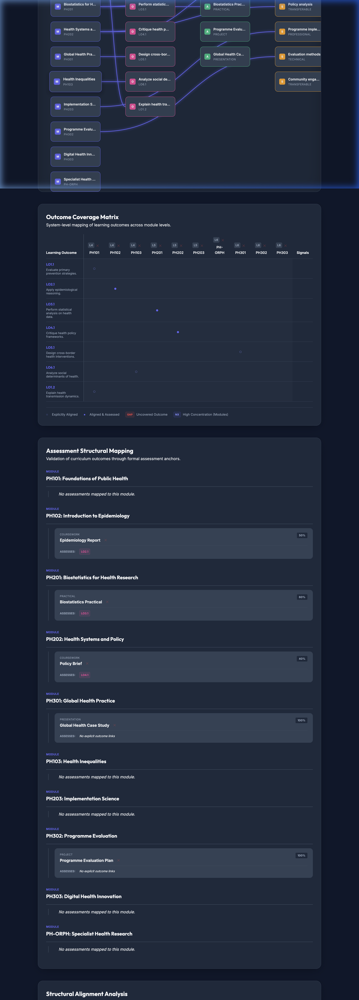

# Curriculum Alignment & Mapping Engine (v1.0)

A local-first, professional-grade tool for curriculum architecture, structural analysis, and exploratory design. The engine provides academic leadership and curriculum designers with a high-fidelity map of relational alignments between modules, learning outcomes, assessments, and skills.

🌐 **Live Hosted Version**
[http://cloudpedagogy-curriculum-simulation-tool.s3-website.eu-west-2.amazonaws.com/](http://cloudpedagogy-curriculum-simulation-tool.s3-website.eu-west-2.amazonaws.com/)

🖼️ **Screenshot**

---

## 📖 Project Documentation

For a detailed guide on how to navigate the graph, manage alignments, and perform structural explorations, please see the:

👉 **[Detailed User Instructions](./INSTRUCTIONS.md)**

---

## 🛠️ Key Capabilities

- **Interactive Curriculum Map**: Multipartite SVG graph of explicit structural relationships.
- **Outcome Coverage Matrix**: Level-grouped heatmap for gap and concentration analysis.
- **Structural Alignment Analysis**: Real-time diagnostic signals for orphaned entities and unmapped outcomes.
- **Structure Explorer**: Non-destructive "what-if" environment for curriculum refactoring.
- **System Health Engine**: Validates data integrity (broken links, duplicates) in real-time.

---

## 🏗️ Technical Architecture

- **Stack**: Vite + React + TypeScript + Vanilla CSS.
- **Persistence**: Local-first storage using `localStorage`.
- **Logic**: Deterministic, rule-based alignment engine (no AI dependencies).
- **Deployment**: Zero-backend, fully static deployability.

---

🛡️ **Disclaimer**
This repository contains exploratory, framework-aligned tools developed for reflection, learning, and discussion.

These tools are provided as-is and are not production systems, audits, or compliance instruments. Outputs are indicative only and should be interpreted in context using professional judgement.

All applications are designed to run locally in the browser. No user data is collected, stored, or transmitted.

All example data and structures are synthetic and do not represent any real institution, programme, or curriculum.

📜 **Licensing & Scope**
This repository contains open-source software released under the MIT License.

CloudPedagogy frameworks and related materials are licensed separately and are not embedded or enforced within this software.

☁️ **About CloudPedagogy**
CloudPedagogy develops open, governance-credible resources for building confident, responsible AI capability across education, research, and public service.

**Website**: [https://www.cloudpedagogy.com/](https://www.cloudpedagogy.com/)
**Framework**: CloudPedagogy AI Capability Framework
